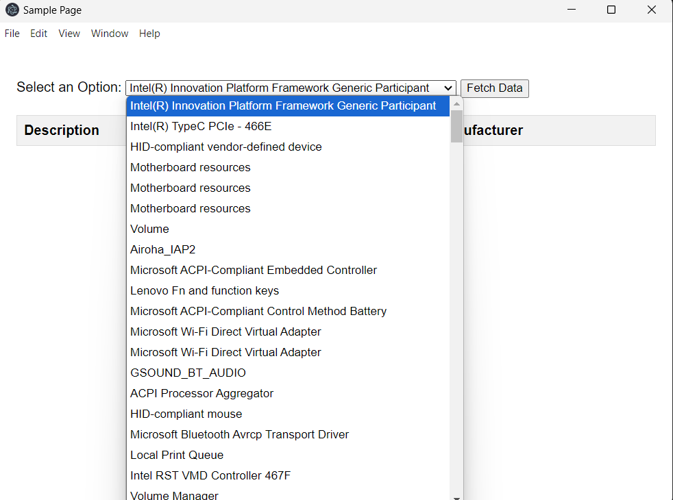

# DeviceIDToolkit

This prototype desktop application can soothe your needs in finding Hardware IDs for products in your device manager. Using a combination of PowerShell Scripts, JavaScript, HTML, Node.js, etc. A application was developed that can list the items in the device manager and be able to render them in an application using HTML Tables. The application is still under development but feel free to play around with it, and modify it for your needs.

## August 22, 2024

Here is an image of how the application looks like with drop down menu expanded.

Additionally if the options has values it then parses the option into a table:

## Acknowledgements

 - Professors at Kean University
 - Professors at NJIT
 - Research Mentors at Kean University
 - StackOverflow Q&A Discussion
 - ChatGPT
 - ClaudeAI

## Authors

- [@FPyC639](https://github.com/FPyC639)

## Appendix

