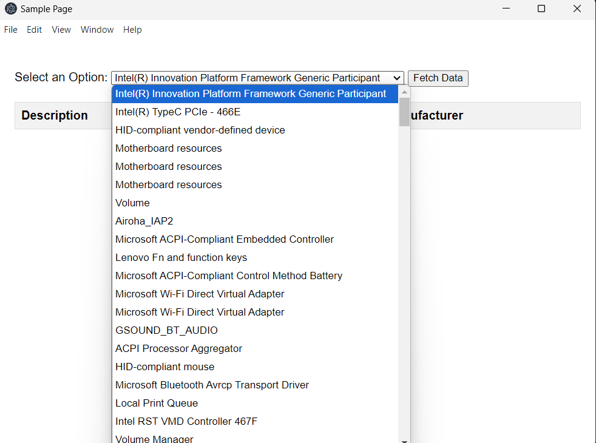
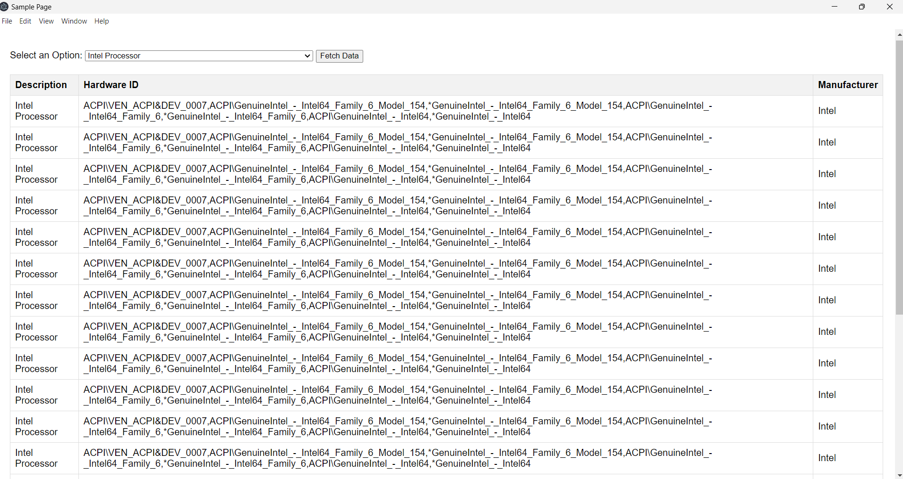
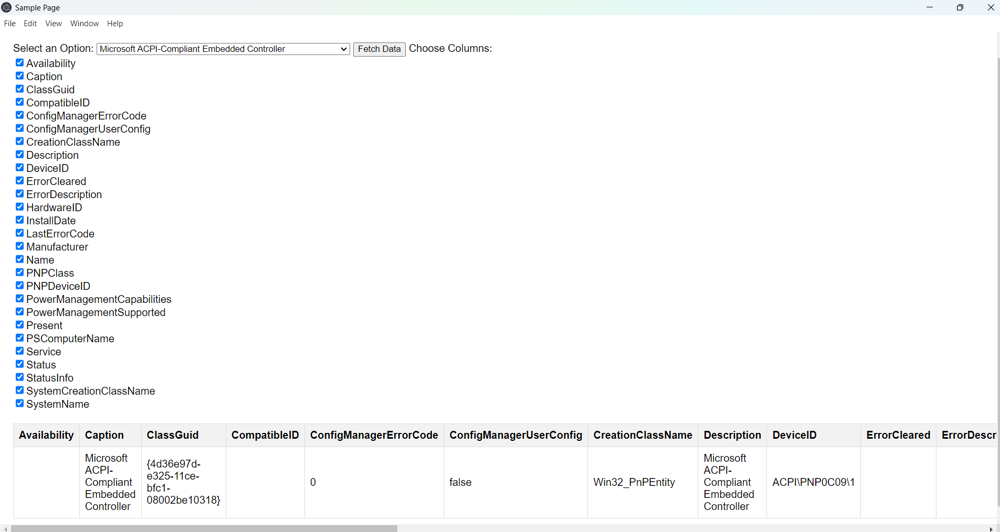
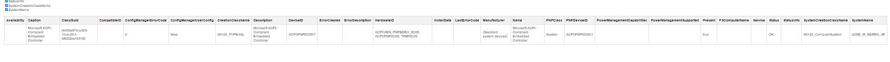
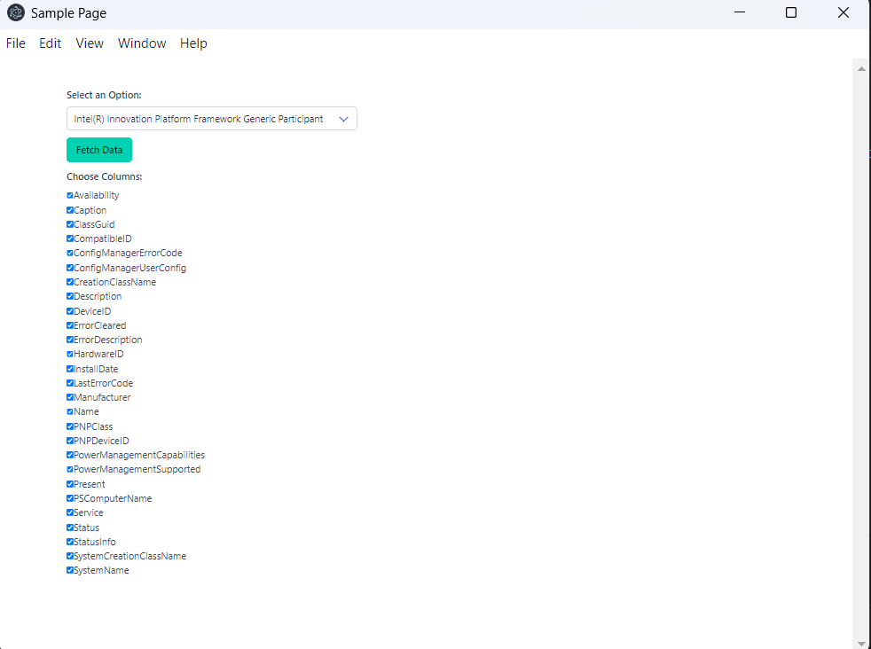
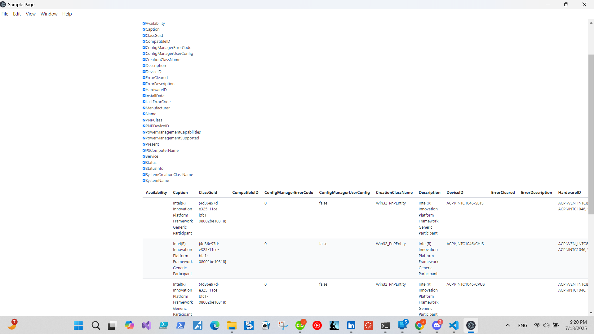

# DeviceIDToolkit

This prototype desktop application can soothe your needs in finding Hardware IDs for products in your device manager. Using a combination of PowerShell Scripts, JavaScript, HTML, Node.js, etc. A application was developed that can list the items in the device manager and be able to render them in an application using HTML Tables. The application is still under development but feel free to play around with it, and modify it for your needs.

## August 22, 2024

Here is an image of how the application looks like with drop down menu expanded.

Additionally if the options has values it then parses the option into a table:

## July 15, 2025

The application has had some updates since August of last year. It has now the ability to select the Properties of PnpEntity Class.
Additionally it renders the selected columns in the table.

This is how long the table is if you select all the columns:

## July 25, 2025

The application has had an update on styling it now uses Bulma CSS. It's minimalist approach looks nice.

This is without the table.

This is with the table.

## Acknowledgements

 - Professors at Kean University
 - Professors at NJIT
 - Research Mentors at Kean University
 - StackOverflow Q&A Discussion
 - ChatGPT
 - ClaudeAI

## Authors

- [@FPyC639](https://github.com/FPyC639)

## Appendix

